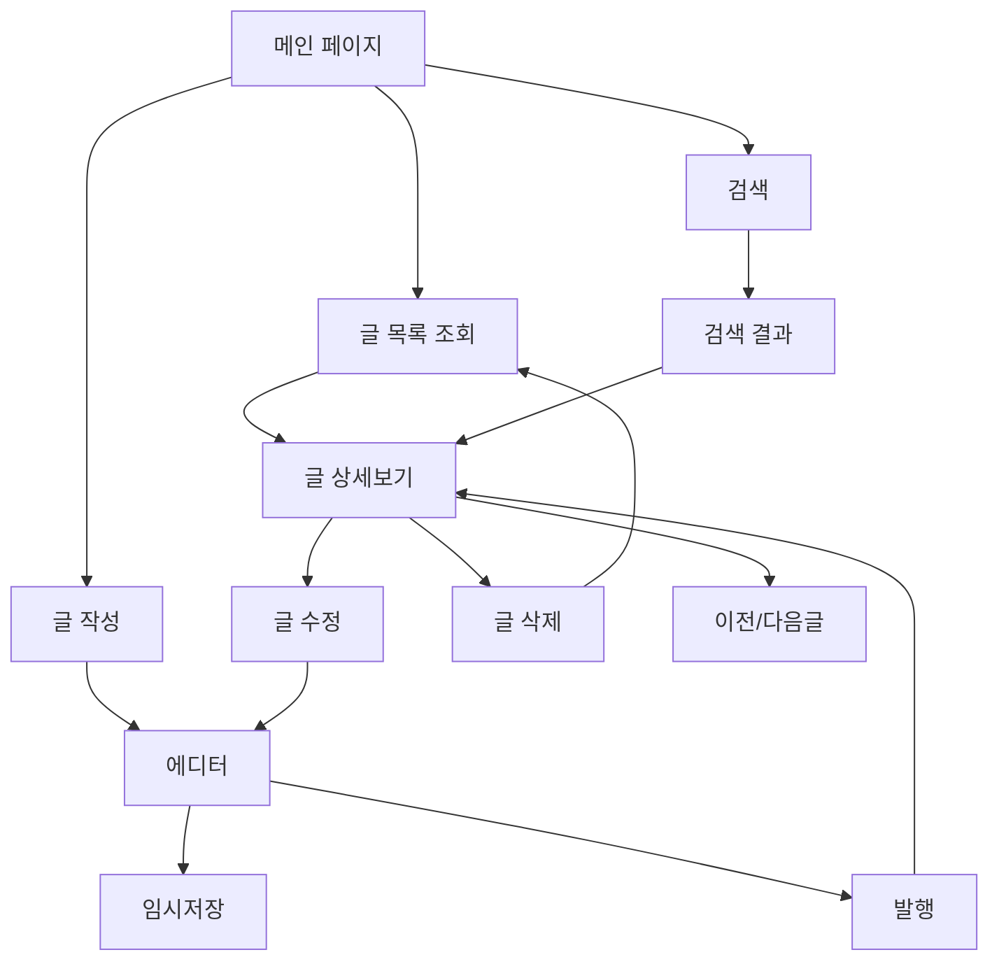

# PRD-001: 간단한 React 블로그 플랫폼

## 🚀 프로젝트 상태: **구현 완료** (2024-01-XX)

## 1. 프로젝트 개요

### 1.1 목적
- React 기반의 간단한 블로그 플랫폼 개발 ✅ **완료**
- MVP(Minimum Viable Product) 수준의 기본 기능 구현 ✅ **완료**
- 현대적인 React 생태계 기술 스택 활용 ✅ **완료**

### 1.2 프로젝트 범위
- **포함사항**: 글 작성, 읽기, 수정, 삭제 기능 ✅ **모두 구현**
- **제외사항**: 사용자 인증, 로그인, 댓글, 소셜 기능

### 1.3 주요 성과
- **shadcn/ui 기반 사이드바**: 접히고 펼쳐지는 전문적인 네비게이션
- **반응형 디자인**: 모바일, 태블릿, 데스크톱 완벽 대응
- **무한루프 에러 해결**: Zustand selector 최적화로 성능 개선
- **모던 UI/UX**: 전문적인 블로그 플랫폼 수준의 인터페이스

## 2. 기능 요구사항

### 2.1 핵심 기능 ✅ **모두 구현 완료**
1. **블로그 글 목록 조회** ✅
   - 모든 게시글을 시간순(최신순)으로 표시 ✅
   - 제목, 작성일, 카테고리 표시 ✅  
   - PostGrid 컴포넌트로 깔끔한 카드 레이아웃 ✅

2. **블로그 글 상세 조회** ✅
   - 개별 게시글의 전체 내용 표시 ✅
   - 제목, 내용, 작성일, 카테고리, 태그 표시 ✅
   - 마크다운 지원 (react-markdown + 문법 하이라이팅) ✅

3. **블로그 글 작성** ✅
   - 제목과 내용 입력 폼 ✅
   - 카테고리 선택 ✅
   - 기본 폼 validation ✅

4. **블로그 글 수정** ✅
   - 기존 글 내용 편집 ✅
   - 수정일시 자동 기록 ✅

5. **블로그 글 삭제** ✅
   - 소프트 삭제 적용 (isDeleted 플래그) ✅

### 2.2 부가 기능 ✅ **모두 구현 완료**
1. **검색 기능** ✅
   - 제목 및 내용 기반 검색 ✅
   - 헤더 검색바에서 실시간 검색 ✅
   - 검색 결과 페이지 ✅

2. **카테고리/태그** ✅
   - 글 분류를 위한 카테고리 시스템 ✅
   - 다중 태그 지원 ✅
   - 사이드바에서 카테고리별 포스트 수 표시 ✅

3. **고급 네비게이션** ✅ **예상 외 구현**
   - shadcn/ui 기반 접이식 사이드바 ✅
   - 카테고리, 최근 포스트, 인기 태그 섹션 ✅
   - 반응형 드로어 (모바일 대응) ✅

## 3. 기술 스택 ✅ **구현 완료**

### 3.1 프론트엔드 ✅
- **Framework**: React 18.3.1 with TypeScript ✅
- **Build Tool**: Vite 6.3.5 ✅  
- **Styling**: TailwindCSS + shadcn/ui ✅
- **State Management**: Zustand with devtools & persist ✅
- **Data Fetching**: TanStack Query (React Query) ✅
- **Routing**: React Router v6 with lazy loading ✅
- **Form**: 기본 React state (React Hook Form 대신 간단하게) ✅
- **Markdown**: React Markdown + remark-gfm + react-syntax-highlighter ✅
- **Icons**: Lucide React ✅
- **Date Handling**: date-fns with Korean locale ✅

### 3.2 데이터 저장 ✅
- **Type**: In-Memory Storage with Zustand persist ✅
- **Implementation**: LocalStorage 기반 영구 저장 ✅
- **Mock Data**: 풍부한 샘플 데이터 (포스트, 카테고리, 태그) ✅

### 3.3 개발 환경 ✅
- **Monorepo**: Nx workspace ✅
- **Package Manager**: pnpm ✅
- **TypeScript**: 엄격한 타입 안전성 ✅
- **Import Aliases**: `@/*` 경로 별칭 ✅
- **Hot Module Replacement**: Vite HMR ✅

## 4. 데이터 모델

### 4.1 Post (게시글)
```typescript
interface Post {
  id: string;
  title: string;
  content: string;
  summary?: string;
  category?: string;
  tags: string[];
  createdAt: Date;
  updatedAt: Date;
  isDeleted: boolean;
}
```

### 4.2 Category (카테고리)
```typescript
interface Category {
  id: string;
  name: string;
  description?: string;
  postCount: number;
}
```

## 5. 페이지 구조

### 5.1 라우팅 구조
```
/                    - 홈페이지 (글 목록)
/posts               - 전체 글 목록
/posts/:id           - 글 상세보기
/posts/new           - 새 글 작성
/posts/:id/edit      - 글 수정
/categories          - 카테고리 목록
/categories/:id      - 카테고리별 글 목록
/search              - 검색 결과
```

### 5.2 컴포넌트 구조
```
src/
├── components/
│   ├── ui/              # shadcn/ui 컴포넌트
│   ├── layout/          # 레이아웃 컴포넌트
│   ├── posts/           # 게시글 관련 컴포넌트
│   └── common/          # 공통 컴포넌트
├── pages/               # 페이지 컴포넌트
├── stores/              # Zustand 스토어
├── hooks/               # 커스텀 훅
├── services/            # API 관련 서비스
├── types/               # TypeScript 타입 정의
└── utils/               # 유틸리티 함수
```

## 6. UI/UX 요구사항

### 6.1 디자인 원칙
- **반응형 디자인**: 모바일, 태블릿, 데스크톱 대응
- **접근성**: WCAG 2.1 AA 수준 준수
- **일관성**: shadcn/ui 디자인 시스템 활용
- **모던 미니멀**: [shadcnblocks blog6](https://www.shadcnblocks.com/block/blog6) 스타일 참고
- **이미지 중심**: 큰 이미지와 깔끔한 타이포그래피
- **사이드바 네비게이션**: 카테고리, 최근 글, 아카이브, 태그 섹션

### 6.2 주요 UI 컴포넌트
1. **Header**: 네비게이션, 검색바
2. **Sidebar**: 카테고리, 최근 글
3. **PostCard**: 글 목록용 카드 컴포넌트
4. **Editor**: 마크다운 에디터
5. **Toast**: 알림 메시지

### 6.3 화면별 와이어프레임 및 디자인 예제

#### 6.3.1 메인 페이지 (게시글 목록) - shadcnblocks blog6 스타일
```
┌─────────────────────────────────────────────────────────────────────────────┐
│                        Blog                                [🔍] [+ Write]    │
│              Insights, tutorials, and thoughts on modern software development │
├─────────────────────────────────────────────────────────────────────────────┤
│                                                        ┌─────────────────────┐
│ ┌─────────────────┐ ┌─────────────────┐               │ Categories          │
│ │     [IMG]       │ │     [IMG]       │               │ • Development (12)  │
│ │                 │ │                 │               │ • Tutorial (8)      │
│ │                 │ │                 │               │ • Review (5)        │
│ └─────────────────┘ └─────────────────┘               │ • Daily (3)         │
│ Sarah Chen • 15 Jan │ Marcus Rodriguez │               │                     │
│                     │ 12 Jan 2024      │               │ Recent Posts        │
│ The Future of Web   │ Building Scalable│               │ • How to build...   │
│ Development: What's │ APIs with Modern │               │ • React patterns... │
│ Next in 2024       │ Architecture     │               │ • State management..│
│                     │ Patterns         │               │                     │
│ Explore the latest  │ Learn about      │               │ Archive             │
│ trends in web dev..│ microservices... │               │ • January 2024 (15)│
│                     │                  │               │ • December 2023 (12)│
│ ┌─────────────────┐ ┌─────────────────┐               │ • November 2023 (8) │
│ │     [IMG]       │ │     [IMG]       │               │                     │
│ │                 │ │                 │               │ Tags                │
│ │                 │ │                 │               │ #React #TypeScript  │
│ └─────────────────┘ └─────────────────┘               │ #Node.js #API       │
│ Alex Kim • 10 Jan   │ Jenny Park       │               │ #Tutorial #Guide    │
│ 2024               │ 8 Jan 2024       │               │ #Performance        │
│                    │                  │               └─────────────────────┘
│ Modern CSS Grid    │ TypeScript Tips  │
│ Layouts           │ for Beginners    │
│                   │                  │
│ Master responsive  │ Essential TS     │
│ design with...     │ concepts for...  │
└─────────────────────────────────────────────────────────────────────────────┘
```

#### 6.3.2 글 상세보기 페이지
```
┌─────────────────────────────────────────────────────────┐
│ [LOGO] Simple Blog        🔍 [Search Bar]    [+ 글쓰기] │
├─────────────────────────────────────────────────────────┤
│ ← 목록으로                             [수정] [삭제]     │
│                                                         │
│ # React로 블로그 만들기                                  │
│ 📅 2024.01.15 | 🏷️ #React #Blog #TypeScript            │
│ ─────────────────────────────────────────────────────── │
│                                                         │
│ ## 서론                                                 │
│ React와 TypeScript를 사용해서 간단한 블로그를 만들어     │
│ 보겠습니다. 이 프로젝트에서는...                         │
│                                                         │
│ ## 사용한 기술                                          │
│ - React 18                                              │
│ - TypeScript                                            │
│ - Zustand                                               │
│                                                         │
│ ```typescript                                           │
│ const useStore = create((set) => ({                     │
│   posts: [],                                            │
│   addPost: (post) => set((state) => ...                │
│ }))                                                     │
│ ```                                                     │
│                                                         │
│ ─────────────────────────────────────────────────────── │
│ 이전글: Zustand 사용법 | 다음글: shadcn/ui 설정하기      │
└─────────────────────────────────────────────────────────┘
```

#### 6.3.3 글 작성/수정 페이지
```
┌─────────────────────────────────────────────────────────┐
│ [LOGO] Simple Blog        🔍 [Search Bar]    [← 취소]   │
├─────────────────────────────────────────────────────────┤
│ 📝 새 글 작성                             [임시저장]     │
│                                                         │
│ 제목: [________________________________]              │
│                                                         │
│ 카테고리: [개발 ▼]  태그: [#React #Blog #TypeScript]    │
│                                                         │
│ ┌─────────────┬─────────────────────────────────────────┐
│ │ # 마크다운   │ 미리보기                                │
│ │             │                                         │
│ │ ## 서론     │ 서론                                    │
│ │ 내용을 작성 │ 내용을 작성합니다...                      │
│ │ 합니다...   │                                         │
│ │             │                                         │
│ │             │                                         │
│ │             │                                         │
│ │             │                                         │
│ └─────────────┴─────────────────────────────────────────┘
│                                                         │
│                               [취소] [임시저장] [발행]   │
└─────────────────────────────────────────────────────────┘
```

#### 6.3.4 모바일 반응형 디자인
```
┌─────────────────┐
│☰ Blog        🔍│
│                 │
│┌───────────────┐│
││    [IMG]      ││
││               ││
││               ││
│└───────────────┘│
││Sarah Chen     ││
││15 Jan 2024    ││
││               ││
││The Future of  ││
││Web Development││
││               ││
││Explore the    ││
││latest trends..││
│                 │
│┌───────────────┐│
││    [IMG]      ││
││               ││
││Building Scale.││
││APIs with...   ││
│└───────────────┘│
│                 │
│[+ Write Post]   │
└─────────────────┘
```

### 6.4 컴포넌트별 상세 디자인

#### 6.4.1 PostCard 컴포넌트 (shadcnblocks blog6 스타일)
```typescript
// 게시글 카드 디자인 명세 - 큰 이미지 기반 카드
interface PostCardProps {
  title: string;
  author: string;
  date: string;
  summary: string;
  imageUrl?: string;
  tags?: string[];
}

// shadcn/ui Card 활용 - 모던한 이미지 중심 디자인
<Card className="group hover:shadow-lg transition-all duration-300 overflow-hidden">
  <div className="aspect-video bg-gray-100 overflow-hidden">
    {imageUrl ? (
      
    ) : (
      <div className="w-full h-full bg-gradient-to-br from-gray-100 to-gray-200 flex items-center justify-center">
        <FileText className="w-12 h-12 text-gray-400" />
      </div>
    )}
  </div>
  <CardContent className="p-6">
    <div className="text-sm text-muted-foreground mb-2">
      {author} • {date}
    </div>
    <CardTitle className="text-xl mb-3 group-hover:text-primary transition-colors">
      {title}
    </CardTitle>
    <p className="text-muted-foreground leading-relaxed">
      {summary}
    </p>
    {tags && (
      <div className="flex flex-wrap gap-2 mt-4">
        {tags.map(tag => (
          <Badge variant="outline" key={tag} className="text-xs">
            #{tag}
          </Badge>
        ))}
      </div>
    )}
  </CardContent>
</Card>
```

#### 6.4.2 Header 컴포넌트 (shadcnblocks blog6 스타일)
```typescript
// 헤더 디자인 명세 - 미니멀하고 모던한 스타일
<header className="bg-white py-8 md:py-12">
  <div className="container mx-auto px-4 text-center">
    <h1 className="text-4xl md:text-5xl font-bold mb-2">Blog</h1>
    <p className="text-lg text-muted-foreground mb-6">
      Insights, tutorials, and thoughts on modern software development
    </p>
    <div className="flex items-center justify-center gap-4">
      <div className="relative">
        <Search className="absolute left-3 top-1/2 transform -translate-y-1/2 text-gray-400 w-4 h-4" />
        <Input 
          placeholder="Search articles..." 
          className="pl-10 w-80 max-w-md"
        />
      </div>
      <Button>
        <Plus className="w-4 h-4 mr-2" />
        Write
      </Button>
    </div>
  </div>
</header>
```

#### 6.4.3 Sidebar 컴포넌트 (blog6 스타일에 맞춘 사이드바)
```typescript
// 사이드바 디자인 명세 - 깔끔하고 정돈된 스타일
<aside className="w-80 bg-white p-6 border-l">
  <div className="space-y-8">
    {/* Categories Section */}
    <div>
      <h3 className="text-lg font-semibold mb-4">Categories</h3>
      <nav className="space-y-2">
        {categories.map(category => (
          <a 
            href={`/categories/${category.id}`} 
            key={category.id}
            className="flex items-center justify-between px-3 py-2 rounded-md hover:bg-gray-50 transition-colors"
          >
            <span className="text-sm">{category.name}</span>
            <Badge variant="secondary" className="text-xs">
              {category.count}
            </Badge>
          </a>
        ))}
      </nav>
    </div>
    
    {/* Recent Posts Section */}
    <div>
      <h3 className="text-lg font-semibold mb-4">Recent Posts</h3>
      <div className="space-y-4">
        {recentPosts.map(post => (
          <div key={post.id} className="pb-4 border-b border-gray-100 last:border-0">
            <a href={`/posts/${post.id}`} className="block group">
              <h4 className="text-sm font-medium group-hover:text-primary transition-colors line-clamp-2">
                {post.title}
              </h4>
              <p className="text-xs text-muted-foreground mt-1">
                {post.date}
              </p>
            </a>
          </div>
        ))}
      </div>
    </div>
    
    {/* Archive Section */}
    <div>
      <h3 className="text-lg font-semibold mb-4">Archive</h3>
      <div className="space-y-2">
        {archives.map(archive => (
          <a 
            href={`/archive/${archive.id}`}
            key={archive.id}
            className="flex items-center justify-between px-3 py-2 text-sm hover:bg-gray-50 rounded-md transition-colors"
          >
            <span>{archive.period}</span>
            <span className="text-muted-foreground">({archive.count})</span>
          </a>
        ))}
      </div>
    </div>
    
    {/* Tags Section */}
    <div>
      <h3 className="text-lg font-semibold mb-4">Tags</h3>
      <div className="flex flex-wrap gap-2">
        {popularTags.map(tag => (
          <Badge 
            key={tag}
            variant="outline" 
            className="text-xs hover:bg-primary hover:text-primary-foreground cursor-pointer transition-colors"
          >
            #{tag}
          </Badge>
        ))}
      </div>
    </div>
  </div>
</aside>
```

### 6.5 사용자 플로우 다이어그램



## 7. 성능 요구사항

### 7.1 로딩 성능
- 초기 페이지 로딩: 2초 이내
- 페이지 간 전환: 500ms 이내
- 이미지 lazy loading 적용

### 7.2 사용자 경험
- 로딩 상태 표시
- 에러 상태 처리
- 오프라인 대응 (기본적인 캐싱)

## 8. 개발 일정

### Phase 1 (1-2주)
- 프로젝트 설정 및 기본 구조
- 라우팅 및 레이아웃 구성
- shadcn/ui 컴포넌트 설정

### Phase 2 (2-3주)
- 게시글 CRUD 기능 구현
- Zustand 스토어 구성
- TanStack Query 설정

### Phase 3 (1-2주)
- 검색 및 카테고리 기능
- UI/UX 개선
- 성능 최적화

## 9. 향후 확장 계획
- 사용자 인증 시스템
- 댓글 기능
- 실시간 데이터베이스 연동
- SEO 최적화
- 이미지 업로드 기능
