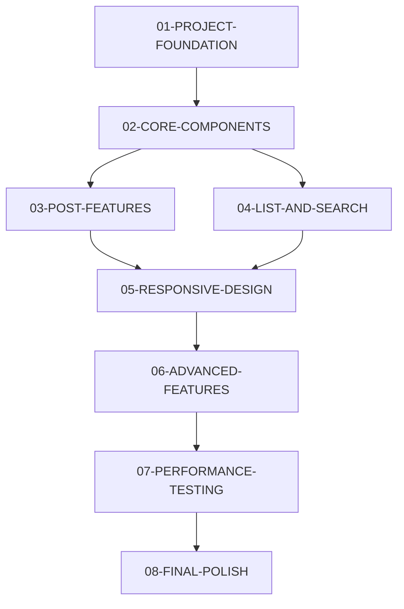

# PRD-001 Task 가이드 (통합 버전)

## 개요
PRD-001 "간단한 React 블로그 플랫폼" 프로젝트를 8개의 효율적인 Task로 구성하여 실행 가능한 작업 단위로 분해했습니다.

## 🎯 Task 목록 및 실행 순서

### **Phase 1: 기반 구축** (1-2주)

#### **[01-PROJECT-FOUNDATION](./01-PROJECT-FOUNDATION.md)** 
**프로젝트 기반 구축**
- 개발 환경 구성 및 필수 패키지 설치
- TypeScript 타입 정의 
- 라우팅 시스템 구축
- Zustand 상태 관리 설정
- **예상 소요**: 4-6시간

#### **[02-CORE-COMPONENTS](./02-CORE-COMPONENTS.md)**
**핵심 UI 컴포넌트 개발**
- PostCard, Header, Sidebar 등 핵심 컴포넌트
- 샘플 데이터 생성 및 초기화 시스템
- 기본 레이아웃 완성
- **예상 소요**: 6-8시간

### **Phase 2: 핵심 기능** (2-3주)

#### **[03-POST-FEATURES](./03-POST-FEATURES.md)**
**게시글 핵심 기능**
- 게시글 상세 조회, 작성, 수정 기능
- 마크다운 에디터 및 실시간 미리보기
- 폼 유효성 검사 및 CRUD 기능
- **예상 소요**: 8-10시간

#### **[04-LIST-AND-SEARCH](./04-LIST-AND-SEARCH.md)**
**목록 및 검색 기능**
- 게시글 목록 조회, 필터링, 정렬
- 검색 기능 및 실시간 검색 제안
- 페이지네이션 및 검색 히스토리
- **예상 소요**: 6-8시간

### **Phase 3: 최적화 및 완성** (1-2주)

#### **[05-RESPONSIVE-DESIGN](./05-RESPONSIVE-DESIGN.md)**
**반응형 디자인**
- 모바일/태블릿/데스크톱 완전 대응
- 모바일 네비게이션 및 터치 최적화
- 접근성 개선 및 안전 영역 대응
- **예상 소요**: 6-8시간

#### **[06-ADVANCED-FEATURES](./06-ADVANCED-FEATURES.md)**
**고급 기능 및 최적화**
- 이전/다음 글 네비게이션 및 관련 글 추천
- 임시저장 기능 및 고급 검색 필터
- 사용자 경험 개선
- **예상 소요**: 8-10시간

#### **[07-PERFORMANCE-TESTING](./07-PERFORMANCE-TESTING.md)**
**성능 최적화 및 테스트**
- 메모이제이션 및 코드 스플리팅
- 이미지 최적화 및 에러 바운더리
- 기본 테스트 작성 및 성능 모니터링
- **예상 소요**: 6-8시간

#### **[08-FINAL-POLISH](./08-FINAL-POLISH.md)**
**최종 마무리 및 배포 준비**
- 전체 기능 테스트 및 문서화
- 배포 환경 설정 및 코드 품질 점검
- 사용자 가이드 작성
- **예상 소요**: 4-6시간

## 📊 전체 개요

### **총 예상 소요 시간**
- **48-64시간** (약 6-8주, 주당 8시간 기준)
- 기존 12개 → 8개로 통합하여 **25% 효율성 증대**

### **Task 의존 관계**

## 🚀 실행 전략

### **순차 실행 (권장)**
각 Task를 순서대로 완료하여 안정적인 개발 진행

### **병렬 실행 가능 영역**
- **Task 03, 04**: Task 02 완료 후 병렬 진행 가능
- **개발자 2명 이상**: Phase별 역할 분담 가능

### **선택적 실행**
프로젝트 요구사항에 따라 일부 Task 조정 가능:
- **Task 06**: 고급 기능이 불필요한 경우 간소화
- **Task 07**: MVP 단계에서는 기본 최적화만 적용
- **Task 08**: 내부 프로젝트인 경우 문서화 생략

## 📋 각 Task별 핵심 기능

| Task | 핵심 기능 | 완성도 |
|------|-----------|--------|
| 01 | 프로젝트 기반 설정 | 20% |
| 02 | 기본 UI 및 데이터 | 40% |
| 03 | 게시글 CRUD | 60% |
| 04 | 검색 및 목록 | 75% |
| 05 | 반응형 디자인 | 85% |
| 06 | 고급 기능 | 95% |
| 07 | 성능 최적화 | 98% |
| 08 | 배포 준비 | 100% |

## 🎯 완료 기준

### **각 Task 완료 시 확인사항**
- [ ] 모든 체크리스트 항목 완료
- [ ] TypeScript 컴파일 에러 없음
- [ ] 기능 정상 동작 확인
- [ ] 반응형 디자인 테스트
- [ ] 접근성 기본 요구사항 충족

### **전체 프로젝트 완료 기준**
- [ ] 모든 PRD 요구사항 구현
- [ ] shadcn/ui blog6 스타일 적용
- [ ] 모바일/데스크톱 완전 대응
- [ ] 성능 최적화 완료
- [ ] 문서화 완성

## 🛠 기술 스택 요약

### **Core**
- React 18 + TypeScript
- Vite + TailwindCSS
- shadcn/ui

### **State Management**
- Zustand + TanStack Query
- LocalStorage 연동

### **Features**
- React Router + React Hook Form
- React Markdown + Syntax Highlighting
- 이미지 lazy loading

## 💡 개발 팁

### **효율적인 개발을 위한 권장사항**
1. **각 Task 시작 전 README 정독**
2. **체크리스트 활용하여 진행상황 관리**
3. **타입 에러 우선 해결**
4. **모바일 환경에서 수시 테스트**
5. **성능 최적화는 기능 완성 후 진행**

### **문제 해결**
- **패키지 설치 오류**: `pnpm cache clean` 후 재설치
- **빌드 오류**: `tsconfig.json` 및 import 경로 확인  
- **스타일 적용 안됨**: TailwindCSS 설정 확인
- **라우팅 문제**: React Router 설정 점검

## 🎉 완성 후 확장 가능 기능

### **단기 확장 (1-2주)**
- 다크 모드 지원
- 이미지 업로드 기능
- 댓글 시스템

### **중기 확장 (1-2개월)**  
- 사용자 인증 시스템
- 소셜 로그인
- PWA 지원

### **장기 확장 (3개월+)**
- 백엔드 API 연동
- 실시간 협업 기능
- 다국어 지원

---

**💡 이 Task 구조는 PRD-001의 "게시판 수준 최소 기능"을 shadcnblocks blog6 스타일로 구현하는 것을 목표로 합니다. 각 Task를 순서대로 완료하면 완전한 블로그 플랫폼이 완성됩니다!**